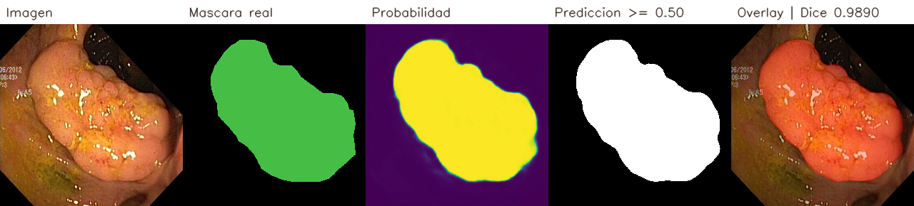
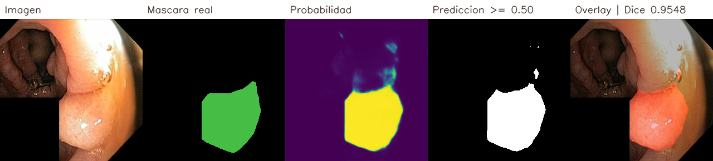
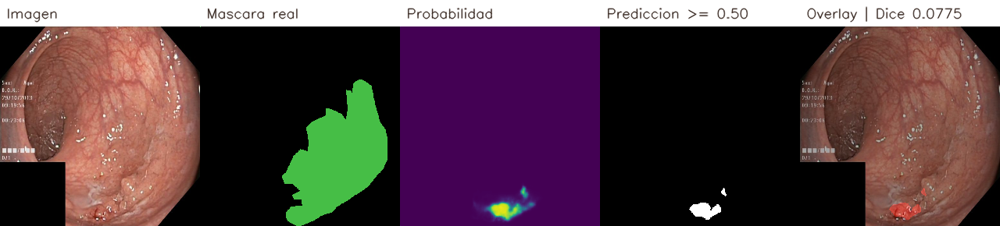

# Reporte técnico final — baseline U-Net/ResNet-34

## Resumen

PolySight Seg estudia la segmentación binaria de pólipos en Kvasir-SEG mediante un
baseline U-Net con encoder ResNet-34 preentrenado en ImageNet. El modelo seleccionado
alcanzó Dice `0.9183967352352693` e IoU `0.8491068445832013` en el conjunto de test de
150 imágenes. Este resultado corresponde al baseline cerrado; no incluye comparación
con otras arquitecturas ni constituye validación clínica externa.

## Datos y protocolo

Se validaron los 1.000 pares imagen/máscara de Kvasir-SEG. Las máscaras JPEG se
binarizan con umbral `128` sin sobrescribir los originales. La partición reproducible,
fijada con semilla `20260817`, contiene 700 imágenes de train, 150 de validation y 150
de test. Se agruparon duplicados exactos y se estratificó por fracción de primer plano.
Los datos disponibles no permiten garantizar separación por paciente o procedimiento.

Validation se utilizó para seleccionar el checkpoint. Test permaneció aislado hasta
cerrar el entrenamiento y se evaluó una sola vez, con umbral operativo fijo `0.5`.
El análisis de otros umbrales sobre test es únicamente descriptivo.

## Modelo y entrenamiento

- Arquitectura: U-Net con encoder ResNet-34 y `24.436.369` parámetros entrenables.
- Entrada y salida: RGB `256 × 256` y logits de un canal a igual resolución.
- Pérdida: BCEWithLogits + Dice, ambas con peso `1.0`.
- Optimizador: AdamW, learning rate `1e-4` y weight decay `1e-4`.
- Scheduler: ReduceLROnPlateau; early stopping con paciencia de 10 épocas.
- Entorno: una NVIDIA A100, AMP `float16` y algoritmos deterministas.

El job Slurm `23312` terminó correctamente después de 32 épocas por early stopping. El
checkpoint ganador fue `best.pt`, seleccionado en la época 22 por Dice de validation
`0.8977634135250631`. Su SHA-256 fijado es
`a3900c2db01e9e17fa7fedce12da94274d8995284f1c37f6e653df402919361b`.

## Evaluación final

El job Slurm `23325` evaluó el checkpoint ganador sobre las 150 imágenes de test con
umbral operativo `0.5`. La sección siguiente combina las métricas micro agregadas con
su distribución por imagen.

La matriz normalizada muestra que se identificó el `91.31 %` de los píxeles de pólipo
y el `98.62 %` de los píxeles de fondo. A umbral `0.5`, la precisión fue ligeramente
mayor que el recall: el modelo omitió más píxeles de pólipo de los que agregó como
falsos positivos.

## Resumen global y distribución por imagen

La agregación global y la distribución por imagen responden preguntas distintas. El
valor global se calcula acumulando los píxeles de las 150 imágenes, mientras que la
mediana, los percentiles y el peor caso otorgan a cada imagen el mismo peso.

| Métrica | Global por píxel | Mediana por imagen | P25–P75 por imagen | Peor caso | UUID del peor caso |
|---|---:|---:|---:|---:|---|
| Dice | 0.9183967352352693 | 0.9549 | 0.9134–0.9693 | 0.0775 | `64e6b365-c78e-4a80-ac17-b644012859f6` |
| IoU | 0.8491068445832013 | 0.9137 | 0.8407–0.9404 | 0.0403 | `64e6b365-c78e-4a80-ac17-b644012859f6` |
| Precisión | 0.9237401535043426 | 0.9681 | 0.9315–0.9825 | 0.2113 | `6f583a87-7ed4-415e-a867-2ab3405389ba` |
| Recall | 0.913114779938238 | 0.9648 | 0.9232–0.9790 | 0.0404 | `64e6b365-c78e-4a80-ac17-b644012859f6` |

Los percentiles se calcularon mediante interpolación lineal sobre las métricas por
imagen. El peor caso es el mínimo independiente de cada fila; por ello, el UUID de
precisión no coincide con el de Dice, IoU y recall. La diferencia entre los resultados
centrales y los mínimos demuestra que el buen desempeño agregado no elimina fallos
severos en muestras particulares.

## Métricas complementarias y evidencia visual

### Panel cualitativo de segmentación

Cada panel presenta, de izquierda a derecha, la imagen endoscópica, la máscara real,
el mapa de probabilidad, la predicción binaria con umbral `0.5` y el overlay sobre la
imagen. Se muestran casos seleccionados de forma determinista por Dice para evitar que
la evaluación visual se limite a un ejemplo favorable.

**Mejor caso — Dice `0.9890`, IoU `0.9783`**

La predicción reproduce casi por completo la extensión y el contorno de la máscara
real, con errores pequeños en el borde.

**Caso cercano a la mediana — Dice `0.9546`, IoU `0.9131`**

Este caso representa mejor el comportamiento habitual que el máximo: existe buen
solapamiento, aunque aparecen pequeñas regiones adicionales y diferencias de contorno.

**Peor caso — Dice `0.0775`, IoU `0.0403`**

El modelo identifica solo una fracción pequeña del pólipo. Su precisión es alta
(`0.9410`) porque los pocos píxeles positivos son mayormente correctos, pero el recall
de `0.0404` evidencia una omisión severa de la región real.

Estos paneles son evidencia cualitativa y no reemplazan la evaluación sobre las 150
imágenes. Para el póster, el caso mediano comunica el rendimiento típico y el peor caso
expone la principal limitación; el mejor caso sirve como referencia del potencial del
modelo.

## Variabilidad y análisis de errores

El Dice por imagen tuvo mediana `0.954879509971524`, media
`0.9090774776019991`, mínimo `0.07747857191064318` y máximo
`0.9890401607948728`. La diferencia entre mediana y mínimo indica que una métrica
agregada alta no evita fallos severos en casos particulares.

El peor caso tuvo precisión `0.94098` pero recall `0.04040`: la predicción detectó una
parte muy pequeña del pólipo real. Otro caso de bajo desempeño presentó recall alto
(`0.97853`) y precisión baja (`0.21135`), compatible con una sobresegmentación marcada.
Por tanto, los errores incluyen tanto omisión de lesión como exceso de región predicha.
Los paneles versionados de mejores, medianos y peores casos permiten inspeccionar estos
comportamientos sin resumirlos en un único promedio.

## Trazabilidad

- Run de entrenamiento MLflow: `5fdf1b9929ec443da426c6442d9e20f1`.
- Run de evaluación MLflow: `73876309ec7c45e09023574a02a47475`.
- Configuración de entrenamiento: [`../configs/training/unet-resnet34-baseline.yaml`](../configs/training/unet-resnet34-baseline.yaml).
- Configuración de evaluación: [`../configs/evaluation/unet-resnet34-baseline.yaml`](../configs/evaluation/unet-resnet34-baseline.yaml).
- Métricas canónicas: [`results/test/metrics.json`](results/test/metrics.json).
- Métricas por imagen: [`results/test/per-image-metrics.csv`](results/test/per-image-metrics.csv).
- Curva de entrenamiento: [`assets/unet-resnet34-training-curves.svg`](assets/unet-resnet34-training-curves.svg).
- Casos cualitativos: [`assets/test/`](assets/test/).

## Límites y conclusión

El experimento usa un solo dataset público pequeño, un único split y una sola semilla.
No existe validación externa, separación clínica garantizada, evaluación prospectiva
ni comparación ejecutada con otro encoder. El modelo no debe utilizarse para tomar
decisiones clínicas.

Dentro de este protocolo, el baseline produjo una segmentación global fuerte y
reproducible. La variabilidad por imagen justifica conservar métricas individuales y
revisar los fallos cualitativos antes de cualquier trabajo de despliegue o validación
adicional.
