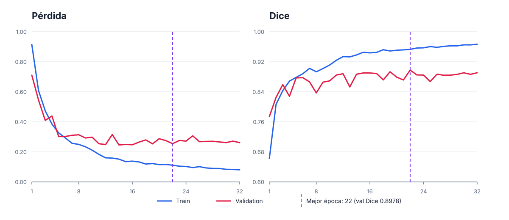

# Presentación de PolySight Seg

Este documento reúne material explicativo para presentar el proyecto y responder
preguntas de la audiencia. Se ampliará conforme avancen las fases.

---

## Preparación de máscaras: binarización de Kvasir-SEG

### Cómo explicarlo durante la exposición

Kvasir-SEG contiene 1.000 imágenes endoscópicas y sus respectivas máscaras de
segmentación. En una máscara ideal, el fondo tendría valor `0` y el pólipo valor `255`.
Sin embargo, las máscaras del dataset están almacenadas como JPEG, un formato con
compresión con pérdida. Esa compresión introduce valores intermedios alrededor de los
bordes y evita que podamos tratar los píxeles originales como categorías exactas.

Por esta razón definimos una regla única y reproducible antes de entrenar:

```text
valor en escala de grises < 128  -> fondo (0)
valor en escala de grises >= 128 -> pólipo (255)
```

Primero convertimos cada máscara RGB a escala de grises y luego aplicamos el umbral. El
resultado contiene únicamente dos valores y representa una tarea de segmentación
binaria: fondo frente a pólipo.

### Por qué esta decisión es importante

Sin una regla explícita, distintas librerías o implementaciones podrían interpretar las
mismas máscaras de manera diferente. Eso afectaría la pérdida, las métricas Dice e IoU,
el tamaño aparente del pólipo y la comparación entre experimentos.

El umbral queda centralizado como parte del código y registrado en el manifest. De este
modo, entrenamiento, validación, test e inferencia usan exactamente la misma definición
de máscara.

### Resultados observados

- Se analizaron las 1.000 máscaras.
- Las 1.000 contienen valores intermedios causados por la compresión JPEG.
- Después del umbral, todas conservan al menos un píxel de fondo y uno de pólipo.
- La proporción global de píxeles de pólipo es aproximadamente `15,64 %`.
- Por imagen, la proporción promedio es `15,39 %` y la mediana es `11,40 %`.
- La máscara más pequeña ocupa aproximadamente `0,47 %` de su imagen.
- La máscara más grande ocupa aproximadamente `81,18 %` de su imagen.

Estos valores muestran un desbalance claro entre fondo y pólipo y también una variación
considerable en el tamaño de las lesiones. Esto justifica usar Dice e IoU como métricas
principales y considerar el tamaño del pólipo al construir los splits.

### Qué no hicimos

- No sobrescribimos las máscaras originales.
- No modificamos el ZIP descargado.
- No elegimos el umbral usando validation o test.
- No tratamos los valores intermedios de JPEG como clases adicionales.
- No ejecutamos PyTorch localmente; esta preparación usa únicamente Pillow.

Las máscaras originales permanecen como fuente inmutable. La binarización se aplica de
forma determinista cuando el pipeline la necesita.

### Preguntas de la audiencia y respuestas

#### ¿Por qué no usar directamente los valores 0 y 255?

Porque JPEG altera los valores durante la compresión. Aunque visualmente la máscara
parezca binaria, sus píxeles contienen muchos niveles intermedios. Exigir solamente `0`
y `255` descartaría información válida o produciría máscaras inconsistentes.

#### ¿Por qué se eligió el umbral 128?

Es el punto medio reproducible del rango de 8 bits entre fondo y primer plano. Se adoptó
como regla de preparación, no como hiperparámetro ajustado con resultados del modelo.
Cambiarlo requeriría versionar nuevamente el manifest y repetir los experimentos.

#### ¿El umbral 128 puede alterar el borde del pólipo?

Sí, cualquier binarización decide cómo clasificar los píxeles ambiguos del borde. Por
eso la regla se documenta y se mantiene idéntica en todos los experimentos. Así la
comparación entre modelos sigue siendo justa.

#### ¿Por qué no guardar nuevas máscaras PNG ya binarizadas?

No es necesario en esta etapa. Conservar la fuente original y aplicar una transformación
determinista evita duplicar datos y mantiene trazabilidad. Si más adelante se materializa
una versión PNG por rendimiento, deberá guardarse como artefacto derivado con su propia
versión y hashes.

#### ¿Por qué pixel accuracy no sería suficiente?

El fondo domina gran parte de las imágenes. Un modelo podría obtener accuracy alta
prediciendo principalmente fondo y aun así segmentar mal el pólipo. Dice e IoU miden
mejor la superposición de la región relevante.

#### ¿La binarización usa PyTorch?

No. Se realiza con Pillow y puede validarse localmente con bajo consumo. PyTorch queda
reservado para entrenamiento y evaluación en el clúster HPC de CEDIA.

#### ¿Se revisaron todas las máscaras o solo una muestra?

Se procesaron las 1.000 máscaras. También se comprobó que cada una coincide en nombre y
dimensiones con su imagen, que los JPEG pueden decodificarse y que el resultado binario
no queda vacío.

---

## División del dataset: train, validation y test

### Cómo explicarlo durante la exposición

Después de validar los 1.000 pares, los dividimos una sola vez en 700 muestras para
train, 150 para validation y 150 para test. La asignación usa la semilla fija `20260817`
y queda guardada por UUID, por lo que todos los modelos se compararán sobre exactamente
las mismas imágenes.

No usamos los folds oficiales de HyperKvasir porque fueron publicados para los 10.662
ejemplos del problema de clasificación, no como un protocolo train/validation/test
específico para segmentación.

### Estratificación por tamaño

Una lesión pequeña y una grande plantean dificultades distintas. Ordenamos las muestras
por la fracción de píxeles ocupada por el pólipo y formamos tres estratos:

- pequeño: hasta aproximadamente `7,70 %`;
- mediano: entre `7,70 %` y `16,69 %`;
- grande: más de `16,69 %`.

Validation y test contienen 50 muestras de cada estrato. Train contiene 234 pequeñas,
233 medianas y 233 grandes. Así evitamos que una partición resulte accidentalmente mucho
más fácil o difícil por el tamaño de sus pólipos.

### Preguntas de la audiencia y respuestas

#### ¿Por qué usar 70/15/15?

Con solo 1.000 pares necesitamos conservar suficientes ejemplos para aprender, pero
también reservar conjuntos independientes con tamaño útil. La proporción deja 700 para
entrenamiento y 150 para cada etapa de selección y evaluación final.

#### ¿Qué diferencia existe entre validation y test?

Validation permite elegir checkpoints, arquitectura e hiperparámetros. Test permanece
aislado y se evalúa una sola vez después de cerrar todas esas decisiones.

#### ¿Cómo se evita el data leakage?

Cada UUID aparece exactamente una vez y los duplicados exactos se asignan como grupo a
un solo split. Además, el pipeline recibe la partición ya creada y no puede reorganizarla
durante el entrenamiento.

#### ¿Existe separación por paciente?

No podemos garantizarla porque los datos publicados no incluyen identificadores
suficientes de paciente o procedimiento. Esta es una limitación explícita: garantizamos
separación por archivo y duplicado exacto, no independencia clínica.

#### ¿Por qué no cambiar el split si un resultado es malo?

Porque adaptar la partición después de observar métricas introduce sesgo y dificulta una
comparación justa. La semilla, asignaciones y hashes quedan fijados antes de entrenar.

---

## Validación del entorno en CEDIA

### Mensaje principal

Antes de entrenar verificamos el entorno, la GPU y el pipeline con trabajos cortos de
Slurm. Esto reduce el riesgo de descubrir errores durante un entrenamiento costoso.

### Evidencia obtenida

- Entorno: Python 3.11.14 y PyTorch 2.10.0+cu128 suministrado por CEDIA.
- Hardware: una NVIDIA A100-SXM4-40GB detectada correctamente.
- Smoke GPU: CUDA disponible y ciclo forward/backward completado.
- Datos: 1.000 pares reconstruidos con los mismos hashes que en local.
- Pipeline: batches de imágenes `[8, 3, 256, 256]` y máscaras `[8, 1, 256, 256]`.
- Splits verificados: 700 train, 150 validation y 150 test.

### Cómo interpretarlo

Estos resultados demuestran que la infraestructura y los datos están listos para
implementar el baseline. Todavía no son resultados de entrenamiento ni métricas de
calidad del modelo.

### Pregunta probable

#### ¿Por qué usar Slurm incluso para pruebas cortas?

Porque el nodo de acceso solo administra archivos y trabajos. Slurm asigna de forma
explícita CPU, memoria y GPU en los nodos de cómputo y deja evidencia reproducible de
cada ejecución.

---

## Funciones de pérdida: BCEWithLogits y Dice

### Cómo explicarlo durante la exposición

Usaremos dos funciones complementarias para enseñar al modelo a separar pólipo y fondo:

- **BCEWithLogitsLoss** evalúa cada píxel de forma individual. Penaliza si un píxel de
  pólipo se predice como fondo o viceversa. Recibe directamente los logits y combina la
  sigmoid internamente para mejorar la estabilidad numérica.
- **Dice loss** evalúa la superposición global entre la máscara predicha y la real. Da
  mayor importancia a la región del pólipo y ayuda cuando el fondo ocupa la mayor parte
  de la imagen.

### Por qué se combinan

BCE aporta aprendizaje preciso por píxel y Dice optimiza la forma y cobertura de la
lesión. Juntas equilibran clasificación local y calidad global de la segmentación.

#### ¿Por qué no usar solamente BCE?

Porque el desbalance favorece al fondo. Un modelo podría acertar muchos píxeles de
fondo y aun representar mal el pólipo; Dice compensa ese problema al medir solapamiento.

---
En el contexto de las redes neuronales y la segmentación de imágenes, el mejor valor para el Dice Loss es 0.
¿Qué significan los valores?
Valor cercano a 0: Es el valor ideal. Significa que la predicción del modelo y la etiqueta real se superponen casi por completo (hay un acierto perfecto).
Valor cercano a 1: Es un mal resultado. Indica que no hay coincidencia ni superposición entre el objeto predicho y el real.

---

## Baseline U-Net con encoder ResNet-34

### Cómo explicarlo durante la exposición

El baseline recibe una imagen RGB de `256 × 256` y produce un mapa de logits de un
canal con la misma resolución. U-Net combina dos recorridos:

1. **Encoder ResNet-34:** extrae características desde bordes y texturas hasta patrones
   de mayor nivel. Comienza con pesos aprendidos en ImageNet.
2. **Decoder U-Net:** recupera progresivamente la resolución y combina información del
   encoder mediante conexiones de salto para localizar mejor los bordes del pólipo.

La salida no incluye sigmoid. Durante la pérdida usamos los logits directamente y,
para calcular métricas o generar una máscara, aplicamos sigmoid y umbral inicial `0.5`.

### Parámetros principales

- Arquitectura: U-Net.
- Encoder: ResNet-34 preentrenado en ImageNet.
- Entrada: `[B, 3, 256, 256]`.
- Salida: `[B, 1, 256, 256]`.
- Parámetros entrenables: `24.436.369`.
- Pérdida: `BCEWithLogitsLoss + Dice loss`, con pesos `1.0 + 1.0`.
- Métricas: Dice, IoU, precisión y recall por píxel.

### Resultado de validación técnica

En una A100 de 40 GB se ejecutó un batch real de ocho imágenes con pesos ImageNet:

- forward y backward completados sin errores;
- logits y gradientes finitos;
- forma de salida correcta;
- pérdida inicial `1,3424`;
- memoria GPU pico aproximada: `908 MiB`.

Este resultado demuestra que el baseline puede entrenarse en CEDIA. La pérdida y las
métricas de este batch pertenecen a un modelo sin entrenar y no miden su calidad final.

### Preguntas de la audiencia y respuestas

#### ¿Por qué usar U-Net?

Porque fue diseñada para segmentación y combina contexto con localización precisa. Es
un baseline conocido, comprensible y adecuado para un dataset pequeño.

#### ¿Por qué usar ResNet-34?

Ofrece un equilibrio razonable entre capacidad y coste. Es suficientemente profunda
para extraer características útiles sin comenzar con un encoder excesivamente grande.

#### ¿Por qué comenzar con pesos ImageNet?

Porque transfieren características visuales generales y reducen la necesidad de
aprender todo desde cero con solo 700 imágenes de entrenamiento.

#### ¿Las métricas del smoke test son el resultado del modelo?

No. Solo verifican que datos, arquitectura, pérdida, métricas y gradientes funcionan
juntos. El rendimiento se medirá después del entrenamiento y la selección por validation.

---

## Entrenamiento del baseline

### Cómo explicarlo durante la exposición

Entrenamos el U-Net/ResNet-34 con 700 imágenes y usamos 150 imágenes de validation para
medir su capacidad de generalizar. El protocolo permitía hasta 50 épocas, pero el
entrenamiento se detuvo automáticamente en la época 32 porque validation dejó de mejorar.
Este mecanismo, llamado *early stopping*, evita continuar memorizando los datos de train.

El mejor resultado apareció en la época 22, con un Dice de validation de `0,8978`. Esto
indica una superposición alta entre los pólipos predichos y las máscaras reales de
validation. Conservamos ese estado como `best.pt`; el estado de la última época se guarda
por separado como `last.pt` y no se usa como el mejor modelo.

### Evidencia principal

- Hardware: una NVIDIA A100 de 40 GB con precisión mixta.
- Mejor Dice de validation: `0,8978` en la época 22.
- Parada: época 32 por *early stopping*.
- Trazabilidad: métricas por época, configuración y entorno registrados en MLflow.
- Integridad: `best.pt` y `last.pt` verificados mediante SHA-256.



La pérdida de train continúa bajando y su Dice sigue subiendo, mientras validation se
estabiliza cerca de `0,89`. Esta separación indica que prolongar el entrenamiento ya no
mejoraba la generalización. Por eso se conserva la época 22 y se detiene el proceso en
la 32 después de diez épocas sin una mejora suficiente.

La figura se genera desde
[`results/unet-resnet34-baseline-history.csv`](results/unet-resnet34-baseline-history.csv)
con:

```bash
python scripts/plot_training_history.py \
  docs/results/unet-resnet34-baseline-history.csv \
  docs/assets/unet-resnet34-training-curves.svg
```

Este es un resultado de **validation**, utilizado para seleccionar el checkpoint. El
conjunto de test permaneció aislado durante esa selección y después se evaluó una sola
vez para obtener la medición final.

---

## Evaluación final sobre test

### Cómo explicarlo durante la exposición

Después de cerrar arquitectura, entrenamiento, checkpoint y umbral, evaluamos `best.pt`
una sola vez sobre las 150 imágenes de test. El modelo alcanzó:

- Dice: `0,9184`;
- IoU: `0,8491`;
- precisión: `0,9237`;
- recall: `0,9131`.

Esto significa que la predicción presenta una superposición alta con las máscaras reales
y mantiene un equilibrio razonable entre regiones detectadas incorrectamente y regiones
del pólipo omitidas. Son métricas micro calculadas sumando todos los píxeles de test.

La matriz de confusión contiene `1.390.325` verdaderos positivos, `114.779` falsos
positivos y `132.293` falsos negativos. Por clase real, el modelo reconoce correctamente
el `98,62 %` del fondo y el `91,31 %` de los píxeles de pólipo.

### El promedio no cuenta toda la historia

El Dice por imagen tuvo mediana `0,9549`, máximo `0,9890` y mínimo `0,0775`. La mayoría
de los casos obtiene una segmentación sólida, pero existen fallos severos que el valor
agregado puede ocultar. En el peor ejemplo, el modelo detecta solo una pequeña zona de
una lesión extensa; este caso debe analizarse y no descartarse como un simple outlier.

**Mejor caso — Dice `0,9890`:**


**Caso cercano a la mediana — Dice `0,9548`:**


**Peor caso — Dice `0,0775`:**


Los datos fuente permanecen en [`results/test/`](results/test/) y el run MLflow final es
`73876309ec7c45e09023574a02a47475`. Estos resultados describen el desempeño sobre
Kvasir-SEG; no constituyen por sí solos una validación clínica ni garantizan el mismo
rendimiento en otros equipos, hospitales o poblaciones.
